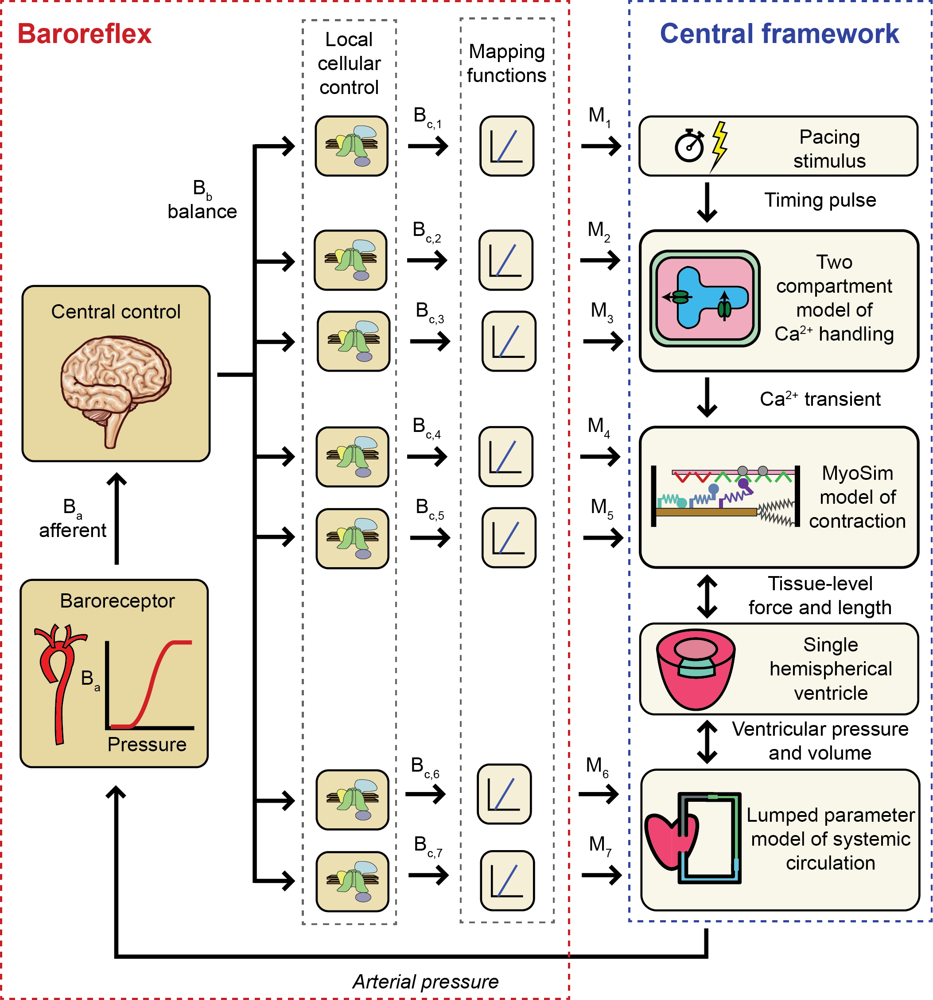

# Baroreflex

## Overview

The baroreflex is a component of the autonomic nervous system that adjusts heart-rate, contractility, and vascular tone to maintain arterial pressure.

FiberVent implements baroreflex control using the procedures described by [Sharifi et al.](https://pmc.ncbi.nlm.nih.gov/articles/PMC10066042/) and summarized in the schematic.

## Algorithm

Arterial pressure $P_{arteries}$ was transduced into a normalized afferent signal $B_a$ via the sigmoidal relationship

$$
\begin{equation}
B_a(t) = \frac{1}{1 + e^{-S(P_{arteries}(t) - P_{set})}}
\end{equation}
$$

where $P_{set}$ is the setpoint for arterial pressure and S defines the slope of the function around its midpoint.

In people, the medulla uses information encoded in the afferent signal to modulate the magnitudes of sympathetic and parasympathetic drive. These efferent signals regulate cellular-level processes in multiple organs so that sustained excess sympathetic drive increases arterial pressure and excess parasympathetic drive decreases it. The current model simplified these complex mechanisms using a single balance signal Bb, seven distinct control signals ($B_{c,1}, B_{c,2} \ldots B_{c,7}$), and seven mapping functions ($M_1, M_2 \ldots M_7$). As described in more detail below, the control signals and mapping functions modulated chronotropism, Ca2+ transients, myofilament function, and vascular tone.

The balance signal $B_b$ is a normalized representation of the difference between sympathetic and parasympathetic efferent activity. Its rate of change was defined as

$$
\begin{equation}
\frac{dB_b(t)}{dt} = 
\begin{cases}
-k_{drive}(B_a(t) - 0.5) B_b(t) &{B_a \ge 0.5} \\
-k_{drive}(B_a(t) - 0.5) (1 - B_b(t)) &{B_a \lt 0.5} \\
\end{cases}
\end{equation}
$$

where $k_{drive}$ is a rate constant. These equations cause $B_b$ to tend towards one when sympathetic drive dominates the control loop and towards zero when parasympathetic drive predominates. $k_{drive}$ sets the speed at which the control signal responds to changes in arterial pressure and/or $P_{set}$.

The control signals $B_{c,i}$ capture how each of the seven reflex-sensitive parameters in the cardiovascular model respond to the balance signal. Similar to equation 2, their rates of change were defined as

$$
\begin{equation}
\frac{dB_{c,i}(t)}{dt} = 
\begin{cases}
-k_{control,i}(B_b(t) - 0.5) (1 - B_{c,i})(t) &{B_b \ge 0.5} \\
-k_{control_i}(B_b(t) - 0.5) B_{c,i}(t)) &{B_b \lt 0.5} \\
\end{cases}
\end{equation}
$$

where $i$ ranges from 1 to 7 and kcontrol,i is the rate constant for system i. These signals are also normalized and represent the status of cellular processes that are regulated by autonomic control. Each signal builds towards a saturating value of one when sympathetic drive exceeds parasympathetic drive (Bb > 0.5). If parasympathetic drive prevails, Bb is less than 0.5, and the control signals fall towards zero.

The final step in the algorithm used mapping functions $M_i$ to link the normalized control signals $B_{c,i}$ to actual parameter values. Each mapping function took the form

$$
\begin{equation}
M_i(B_{c,i}(t)) = 
\begin{cases}
M_{base, i} + \frac{1}{2} (B_{c,i}(t) - 0.5) (M_{symp, i} - M_{base,i}) &{B_{c,i}(t) \ge 0.5} \\
M_{base, i} + \frac{1}{2} (B_{c,i}(t) - 0.5) (M_{para, i} - M_{base,i}) &{B_{c,i}(t) \lt 0.5}
\end{cases}
\end{equation}
$$

where $M_{base,i}$ is the default value for parameter $i$, and $M_{symp,i}$ and $M_{para,i}$ are its limits during maximum sympathetic and maximum parasympathetic drive respectively.

## Implementation functions

|    | Function | Maps to | Increased arterial pressure |
|----|----------|---------|-----------------------------|
|Chronotropism | $M_{1}$ | $t_{RR}$ | Lengthens inter-beat interval and slows heart rate |
|Calcium handling | $M_{2}, M_{3}$ | $k_{SERCA}$ and $k_{act}$ | Reduces the amplitude and prolongs the duration of Ca2+ transients |
|Sarcomere contractility | $M_{4}, M_{5}$ | $k_1$ and $k_{on}$ | Reduces the number of cycling myosin heads and sensitizes the thin filament to Ca2+ |
|Vascular tone | $M_{6}, M_{7}$ | $R_{arteriole}$ and $C_{veins}$ | Reduces systemic afterload nad increases venous compliance |