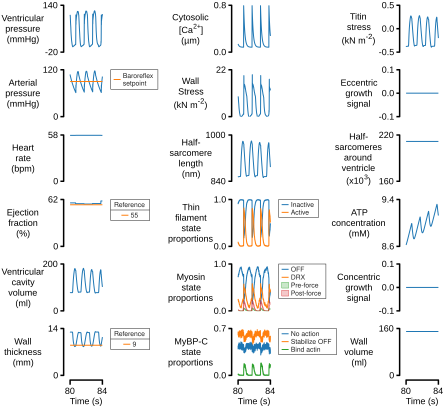
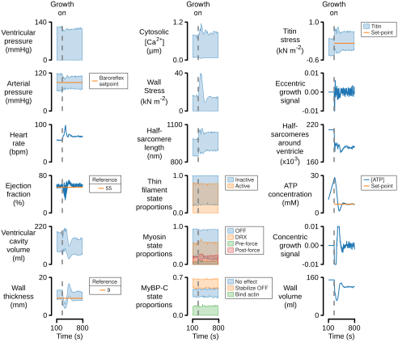

# 2026a

## Overview

This page explains how to reproduce the simulations and figures that were submitted to BioRxiv in May 2026.

Important notes
{: .label .label-blue}

* FiberVent will <i>only</i> run on Windows PCs. 
* Each simulation will take several hours to run on a single thread
* Some figures show simulations collated from hundreds of simulations. The complete set of simulations may take more than a week to complete on a laptop.

## Instructions

### Setup 

+ Clone the [FiberVent repo](https://github.com/Campbell-Muscle-Lab/FiberVent) to a local directory that will be referred to as `<FiberVent_repo>`
+ Install [Conda](https://conda-forge.org/download/) if not already available
+ Install the FiberVent environment by
  + opening a terminal and changing the directory to `<FiberVent_repo>/code/FiberVentPy/environment`
  + run `conda env create -f environment.yml`

### Run simulations

Warning - simulations take hours to run
{: .label .label-blue}

These commands will run the simulations from which the figures are derived. They will not produce 

+ Activate the conda environment with the command `conda activate FiberVent`
+ Change the working directory to `<FiberVent_repo>/code/FiberVentPy/FiberVentPy`
+ To generate the simulations illustrated in Figures 1 and 2
  + Run the command `python fiberventcpy.py characterize ../../../manuscripts/2026a/setup/setup_demonstrate_growth.json`
+ To generate the simulations in Figure S2
  + Run the command `python fiberventcpy.py characterize ../../../manuscripts/2026a/setup/setup_growth_rates.json`
+ Generate the simulations summarized in Figures 3
  + Run the command `python fiberventcpy.py characterize ../../../manuscripts/2026a/setup/setup_scan_parameters.json`

### Create figures

The published figures can be recreated using MATLAB scripts.

+ Clone [MATLAB_UKTCVR](https://github.com/Campbell-Muscle-Lab/MATLAB_UKTCVR) to a local directory that will be referred to as `<UKTCVR_repo>`
+ Start MATLAB
+ Add `<UKTCVR_repo>/code` and its subfolders to the MATLAB path
+ Simulation time-course figures
  + Run `<repo>/manuscripts/2026a/MATLAB_code/figure_simulation_time_courses.m`
    + Creates Figures 1, 2, 
  
+ Summaries of growth
  + Parse simulation files to collate summary data
    + Run `<repo>/manuscripts/2026a/MATLAB_code/blah`
  + Generate figures
    + Run `<repo>/manuscripts/2026a/MATLAB_code/figure_xy.m`

## Output

Figure 1 

Figure 2 

